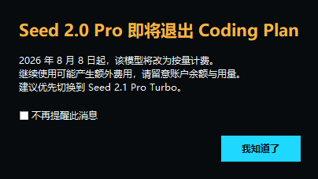

# 芊熠智能打标工作台

面向 LoRA、图像生成和视频生成训练集的 Windows 桌面标注工具。批量扫描图片与视频，调用豆包视觉模型生成高质量 sidecar TXT，并在同一个工作台中完成复核、清理、重试和训练数据导出。

[](https://www.python.org/)
[](https://github.com/wozhendemeiyou/qianyi-media-caption-tool/releases/latest)
[](./tests)
[](https://github.com/wozhendemeiyou/qianyi-media-caption-tool/releases/tag/v3.3)

> API Key 不在仓库、程序包或普通配置文件中。用户在软件内自行填写后，密钥使用 Windows DPAPI 加密并保存在当前 Windows 账户的本地应用目录。

## 界面预览


<p align="center">
  
  
</p>

## 为什么使用它

| 亮点 | 带来的价值 |
| --- | --- |
| 一次扫描，完整配对 | 递归发现图片、视频和同名 TXT，立即区分缺少标签、无效标签、孤立 TXT、不可读媒体与输出冲突。 |
| 面向训练目标的提示策略 | 可选择训练主体、风格 LoRA 或风景/场景侧重点，支持中文自然语言、英文描述和逗号词组标签。 |
| 可恢复的批处理 | 跳过已有有效 TXT，失败项独立记录并可重试；停止任务后再次运行不会浪费已经完成的结果。 |
| 实际 10 并发 | 外部 API 后台可同时执行 10 个请求。标准压力测试记录 `peak_active_requests: 10`，界面数值与线程池一致。 |
| 安全的密钥与数据边界 | API Key 由 DPAPI 加密；项目删除只清理应用元数据，不删除原始媒体；生成结果只写入同名 TXT。 |
| 可视化复核 | 缩略图网格和紧凑列表自由切换，支持搜索、状态筛选、多选、结果编辑、触发词补写和批量替换。 |
| 孤立 TXT 治理 | 直接列出有 TXT、无媒体的历史残留，可查看内容、在资源管理器定位或确认删除，并且绝不会送入模型或训练数据导出。 |
| 离线质量工具 | 感知哈希相似图检测、JSONL/CSV 导出和完整离线压力测试均不产生 API 费用。 |

## 典型工作流

1. 在项目中心添加一个媒体目录。
2. 选择图片或视频、输出格式、训练侧重点、语言、模型和并发数。
3. 在设置中填写自己的火山方舟 API Key。
4. 点击“扫描”，先处理缺少 TXT、无效 TXT、孤立 TXT 和重名输出冲突。
5. 点击“开始任务”或只处理当前筛选/选中的素材。
6. 在右侧检查生成结果，必要时编辑、批量替换或添加触发词。
7. 导出训练数据 JSONL/CSV，或直接使用媒体旁的 sidecar TXT。

每个媒体文件对应同目录、同文件名的 TXT：

```text
dataset/
├── image-001.jpg
├── image-001.txt
├── image-002.png
├── image-002.txt
├── clip-001.mp4
└── clip-001.txt
```

## 核心能力

### 扫描与质量检查

- 支持 JPG、JPEG、PNG、WebP、GIF、HEIC、HEIF、MP4、MOV 和 AVI。
- 单次目录遍历同时收集媒体与 TXT，自动忽略 Windows 系统目录。
- 检测无法解码的图片、空 TXT、错误响应 TXT、缺失 TXT 和孤立 TXT。
- 检测同名不同扩展媒体写入同一个 TXT 的冲突，冲突项不会发送 API 请求。
- 图片自动应用 EXIF 方向；HEIF/HEIC 使用独立解码保护。

### 批量打标

- 外部 API 支持 1 至 10 并发，本地模型固定单并发控制显存。
- 生成请求不自动重试，避免网络超时后重复计费；失败项由用户明确触发重试。
- 支持中止，网络退避可取消，未开始的队列项会标记为已取消。
- 每个成功结果先原子写入 TXT，再更新项目状态，意外退出时已完成结果仍然保留。
- 可为所有有效结果补写训练触发词，重复执行不会重复添加。

### 复核与整理

- 缩略图网格、紧凑列表、分页、文件名搜索和状态筛选。
- 多选后强制重新打标、批量替换文本或导出当前范围。
- 孤立 TXT 使用独立列表显示，不进入缩略图解码队列，不会锁定或误处理文件。
- 离线感知哈希相似图检测只筛选候选项，不自动删除用户素材。

## 模型与计费路由

| 界面模型 | 模型 ID | 请求地址 | 用量标签 |
| --- | --- | --- | --- |
| 豆包 Seed 2.1 Pro Turbo | `doubao-seed-2-1-turbo-260628` | `/api/coding/v3/chat/completions` | Coding Plan |
| 豆包 Seed 1.6 Vision | `doubao-seed-1-6-251015` | `/api/coding/v3/chat/completions` | Coding Plan |
| 豆包 Seed 2.1 Pro | `doubao-seed-2-1-pro-260628` | `/api/v3/chat/completions` | 按量计费 |
| 豆包 Seed 2.0 Pro（2026-08-08 前） | `doubao-seed-2-0-pro-260215` | `/api/coding/v3/chat/completions` | Coding Plan（8 月 8 日下线） |
| 豆包 Seed 2.0 Pro（2026-08-08 起） | `doubao-seed-2-0-pro-260215` | `/api/v3/chat/completions` | 按量计费 |

Seed 2.0 Pro 在 2026 年 8 月 8 日当天自动切换到按量接口。软件启动后会用独立置顶窗口提醒计费变化，用户可以选择“不再提醒此消息”，并可在设置中重新开启。



## 安全与隐私

- 仓库和 Release 安装包不包含 API Key、最近项目、数据集路径或运行记录。
- API Key 通过 Windows DPAPI 加密到 `%LOCALAPPDATA%\MediaCaptionTool\credentials.bin`。
- 普通设置 JSON 不保存明文 API Key、模型接口地址或认证头。
- HTTP 错误日志会清理 Bearer Key，并保留请求 ID 便于排查。
- 项目运行状态、失败清单和日志位于 `%LOCALAPPDATA%\MediaCaptionTool`。
- “删除项目”只删除应用自身的项目元数据，绝不递归删除媒体目录。
- 自动更新功能未启用，程序不会访问未声明的更新服务器。

## 下载与运行

无需 Python 的用户可从 [GitHub Releases](https://github.com/wozhendemeiyou/qianyi-media-caption-tool/releases/latest) 下载 Windows 品鉴包，解压后运行 EXE。

源码运行需要 Python 3.12：

```powershell
git clone https://github.com/wozhendemeiyou/qianyi-media-caption-tool.git
cd qianyi-media-caption-tool
python -m venv .venv312
.\.venv312\Scripts\python.exe -m pip install -r requirements.txt
.\.venv312\Scripts\python.exe media_caption_tool_v3.py
```

首次使用时进入“设置”，填写自己的火山方舟 API Key。仓库没有示例 Key，也不需要创建包含明文 Key 的配置文件。

## 本地模型

“外部 API / 本地模型”可在任务开始前切换。本地后端加载用户指定目录中的 Hugging Face 视觉语言模型，目录必须包含 `config.json`。本地后端目前支持图片，固定单并发；视频仍使用外部 API。

根据显卡环境安装 PyTorch 后，再安装本地模型依赖：

```powershell
.\.venv312\Scripts\python.exe -m pip install -r requirements-local.txt
```

模型需要兼容 `AutoProcessor`，以及 `AutoModelForImageTextToText`、`AutoModelForVision2Seq` 或自定义 `AutoModelForCausalLM` 加载接口。

## 测试与压力验证

所有自动化测试和压力测试均使用模拟接口，不访问付费 API。

```powershell
.\.venv312\Scripts\python.exe -m unittest discover -s tests -v
.\.venv312\Scripts\python.exe tools\stress_test.py --profile quick
.\.venv312\Scripts\python.exe tools\stress_test.py --profile standard
```

2026-07-29 标准档结果：

| 场景 | 规模 | 结果 |
| --- | --- | --- |
| 大目录扫描 | 10,000 个有效媒体、50 个坏文件、100 个孤立 TXT | 通过 |
| 并发批处理 | 2,000 项、10 并发、模拟失败 | 通过，峰值活跃请求 10 |
| 负载中取消 | 2,000 项 | 通过，取消延迟 0.891 秒 |
| JSONL/CSV 导出 | 10,000 条 | 通过 |
| 最坏重复图聚类 | 1,500 张同组图片 | 通过 |

标准档总耗时 76.615 秒，峰值 RSS 77.48 MB；完整报告见 [`docs/stress-report.json`](docs/stress-report.json)。这验证的是本地处理路径，不代表火山方舟账户的服务端限流或配额容量。

## 构建 Windows EXE

```powershell
.\.venv312\Scripts\pyinstaller.exe --noconfirm MediaCaptionTool-3.3.spec
```

构建配置只收集运行所需代码与四个视觉资源，不打入 API Key、用户设置、项目记录或本地模型权重。

## 项目结构

```text
.
├── assets/                       # 启动页与应用图标
├── docs/                         # 匿名产品截图和压力报告
├── tests/                        # 核心与 GUI 离线测试
├── tools/                        # 截图和压力测试工具
├── media_caption_core.py         # 扫描、模型路由、HTTP、日志与批任务
├── media_caption_tool_v3.py      # Tkinter 桌面工作台
├── MediaCaptionTool-3.3.spec     # PyInstaller 单文件构建
├── requirements.txt              # 基础依赖
└── requirements-local.txt        # 可选本地模型依赖
```

## 使用提示

- 真实 API 调用可能产生费用，请根据账户额度选择模型和并发数。
- Coding Plan 或账户侧可能限制并发；客户端支持 10 并发不代表所有账户都拥有 10 并发配额。
- 在批量处理前先用少量素材验证提示词、输出语言和模型计费方式。
- 对重要数据集执行孤立 TXT 删除、批量替换等操作前，建议保留备份。
