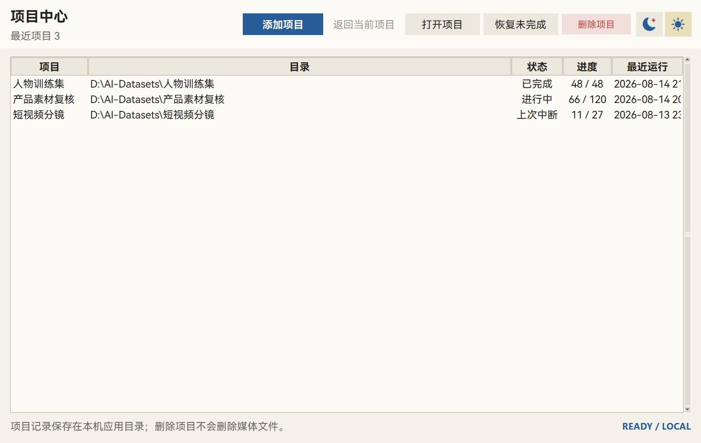
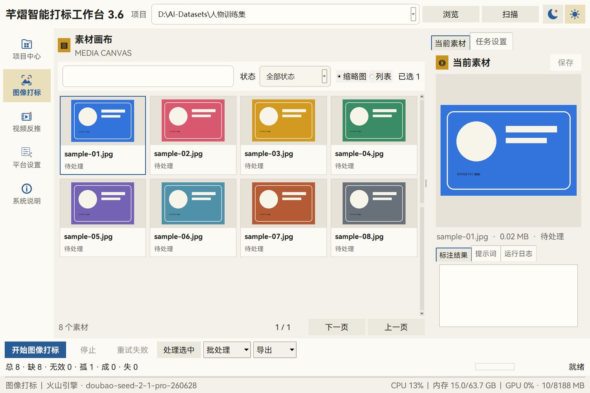
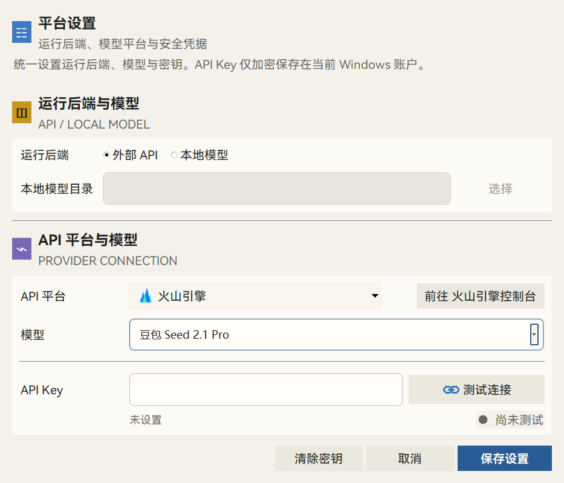
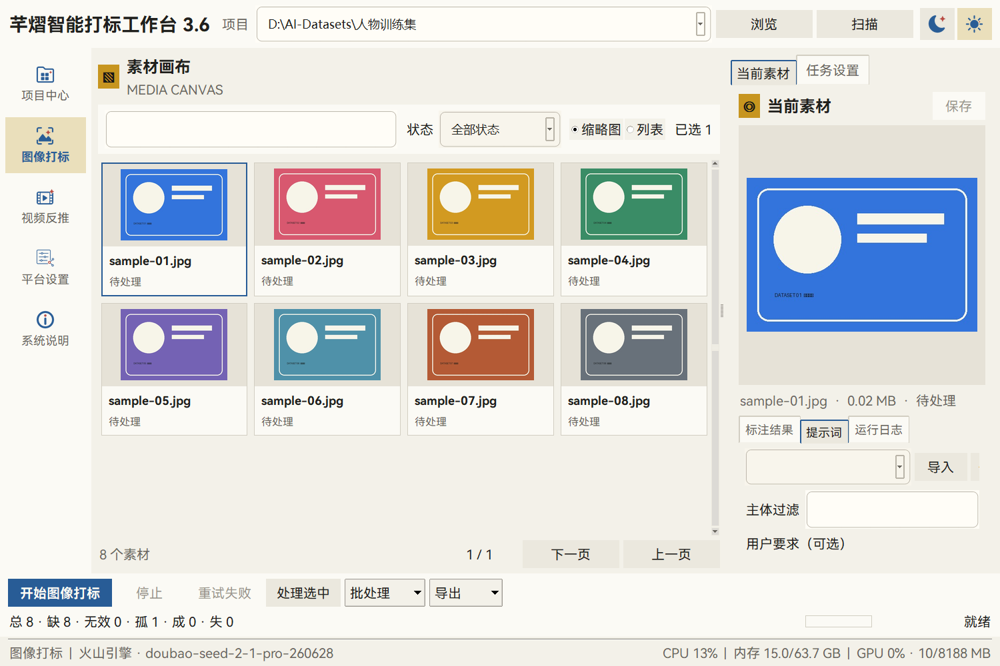
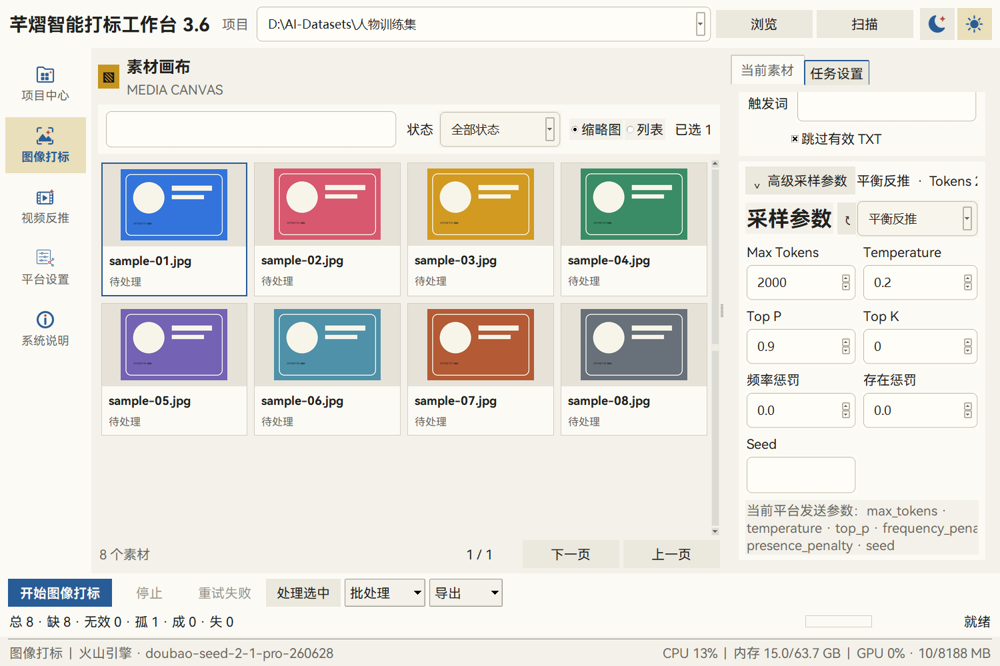
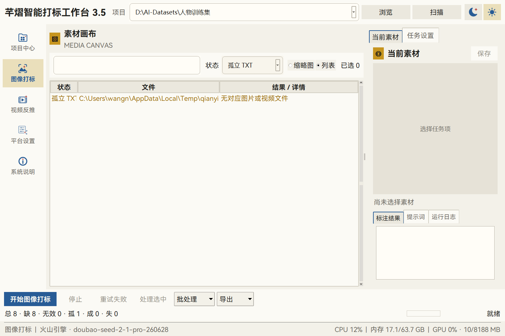
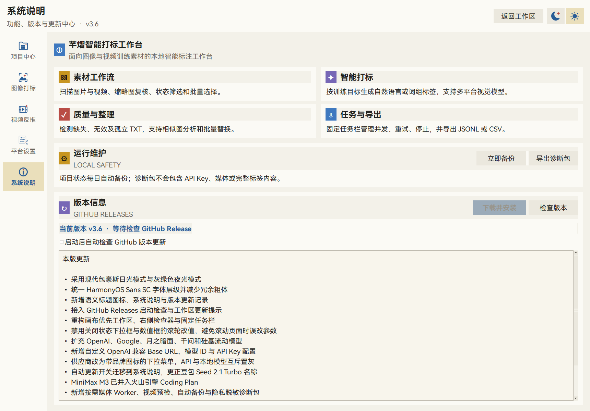

# 芊熠智能打标工作台图文使用手册

本手册对应 v3.6.4。公开版不带 API Key 和提示词模板，所有凭据与模板均由用户在自己的 Windows 账户中配置。

## 1. 启动与项目中心

程序启动后进入项目中心。这里用于添加媒体目录、继续已有项目、恢复意外中断任务和查看项目进度。

建议每个训练集使用独立目录。程序只读取媒体、写入同名 TXT 和应用自身的项目元数据；“删除项目”不会删除原始媒体目录。

## 2. 工作区结构

工作区分为四个稳定区域：

1. **左侧导航**：项目中心、图像打标、视频反推、平台设置、系统说明；
2. **中部素材画布**：搜索、状态筛选、缩略图/列表、分页和多选；
3. **右侧检查器**：当前素材预览、标注结果、提示词、日志和任务设置；
4. **底部任务栏**：开始、停止、重试、批处理、导出、进度与硬件状态。

## 3. 首次配置平台

点击左侧“平台设置”。

配置顺序：

1. 选择外部 API 或本地模型；
2. 使用外部 API 时，在带品牌图标的菜单中选择服务商和模型；
3. 使用自定义兼容接口时，填写模型 ID 与 OpenAI 兼容 Base URL；
4. 填写自己的 API Key；自托管接口无需认证时可以留空；
5. 点击“测试连接”；
6. 连接状态变为绿色后保存。

外部 API 与本地模型互斥：外部 API 模式会锁定本地模型目录，本地模型模式会将供应商、模型、Base URL 和 API Key 区域整体置灰。API Key 不写入仓库或普通 JSON，而是使用 Windows DPAPI 分平台加密。内置服务商不显示 Base URL，只需要填写 API Key；选择自定义兼容接口后才会展开 Base URL 与 API Key。

“API 平台与模型”标题右侧提供两个圆角滑块：

- **启用 MTP**：仅对具备原生多 Token 预测层、且当前 Transformers 支持 `use_mtp` 的本地模型生效；不兼容时自动回退普通生成。外部云 API 是否使用 MTP 由服务商推理端控制。
- **移除思考标签**：默认开启。兼容平台会尽量关闭思考输出，最终结果还会统一清理 `<think>`、`<thinking>`、`<analysis>`、`<reasoning>` 等区块，避免推理过程写入 TXT。

## 4. 创建自己的提示词模板

公开版首次启动时提示词库为空。进入“当前素材 → 提示词”：

- **主体过滤**：可选，只关注某类人物、物体或场景；
- **用户要求**：本次任务的补充要求；
- **系统提示词模板**：长期复用的输出规范，必须由用户自行编写或导入；
- **保存**：使用主题化命名弹窗将当前系统提示词保存到本机；
- **导入**：读取本地 TXT/Markdown 模板；
- **删除**：删除当前用户预设。

右侧局部滚动条只控制上述三项，不影响顶部预设栏、其他标签页或任务设置。

## 5. 设置输出和采样参数

进入“任务设置”，选择自然语言或词组标签、输出语言、训练侧重点、触发词和并发数。

高级采样参数包括：

- Max Tokens；
- Temperature；
- Top P；
- Top K；
- 频率惩罚；
- 存在惩罚；
- Seed。

稳定、平衡、创意三个采样预设只改变采样参数，不改变用户的系统提示词。关闭状态的下拉框和数值框不会被鼠标滚轮误改。

## 6. 扫描与质量检查

选择项目目录后点击“扫描”。系统会在一次遍历中区分：

- 缺少同名 TXT；
- 空 TXT 或错误响应 TXT；
- 有 TXT 但媒体已经不存在的孤立 TXT；
- 图片无法解码；
- 同名不同扩展媒体争用同一个 TXT 的输出冲突。

孤立 TXT 不会进入模型任务或训练数据导出。用户可查看内容、在资源管理器中定位，或确认删除单个残留文件。

## 7. 执行、停止与恢复

- “开始任务”处理当前有效范围；
- “处理选中”只处理多选素材；
- “重试失败”只重新执行失败项；
- “停止”会取消等待队列并保留已经成功写入的 TXT；
- 项目异常中断后，可在项目中心点击“恢复未完成”。

外部 API 支持 1–10 并发。选择本地模型时，界面会提示并发数越高显存占用越大；当前本地后端固定单并发并推荐设为 1，以避免显存竞争。生成请求不会自动重试，以降低重复计费风险。

## 8. 复核、整理与导出

在右侧“标注结果”直接修改单条 TXT；也可以多选后批量替换文本、补写触发词或强制重新生成。

导出支持：

- JSONL：适合训练和程序读取；
- CSV：适合表格复核；
- sidecar TXT：媒体旁已经生成，可直接供常见训练流程使用。

## 9. 系统说明与应用内更新

系统说明页显示当前版本、功能说明、更新记录、备份与诊断入口。“启动后自动检查 GitHub 版本更新”也在版本信息区域统一管理。发现新版后，工作区会显示更新提示；用户确认后可直接在软件内下载、校验、覆盖并重启，不需要手动前往下载页。

> **v3.5 / 初始 v3.6 升级提示：**旧版更新器使用了不兼容的 Windows 独立进程标志，可能在下载完成后没有执行覆盖和重启。请从 GitHub Release 手动运行一次当前最新版；从 v3.6.1 开始，后续版本可恢复软件内自动更新。

## 10. 常见问题

### 为什么首次启动没有提示词模板？

为了确保公开仓库和 Release 不携带任何作者或用户模板，v3.5 起公开版默认模板库为空。请自行编写、导入并保存。

### 为什么无法开始任务？

请依次检查：项目目录、系统提示词、平台模型、API Key/本地模型目录和连接状态。

### 软件会上传整个项目吗？

不会。请求只发送当前任务所需的媒体内容与提示词。项目状态、模板和凭据保存在本机。

### 删除项目会删除图片或视频吗？

不会。“删除项目”只清除应用元数据。只有明确执行“删除孤立 TXT”时，才会删除用户确认的单个 TXT 文件。

### 视频为什么提示缺少 FFmpeg？

FFmpeg/FFprobe 用于视频预检、抽帧和音频提取。缺少时程序会尝试使用平台原生视频输入，图片功能不受影响。
